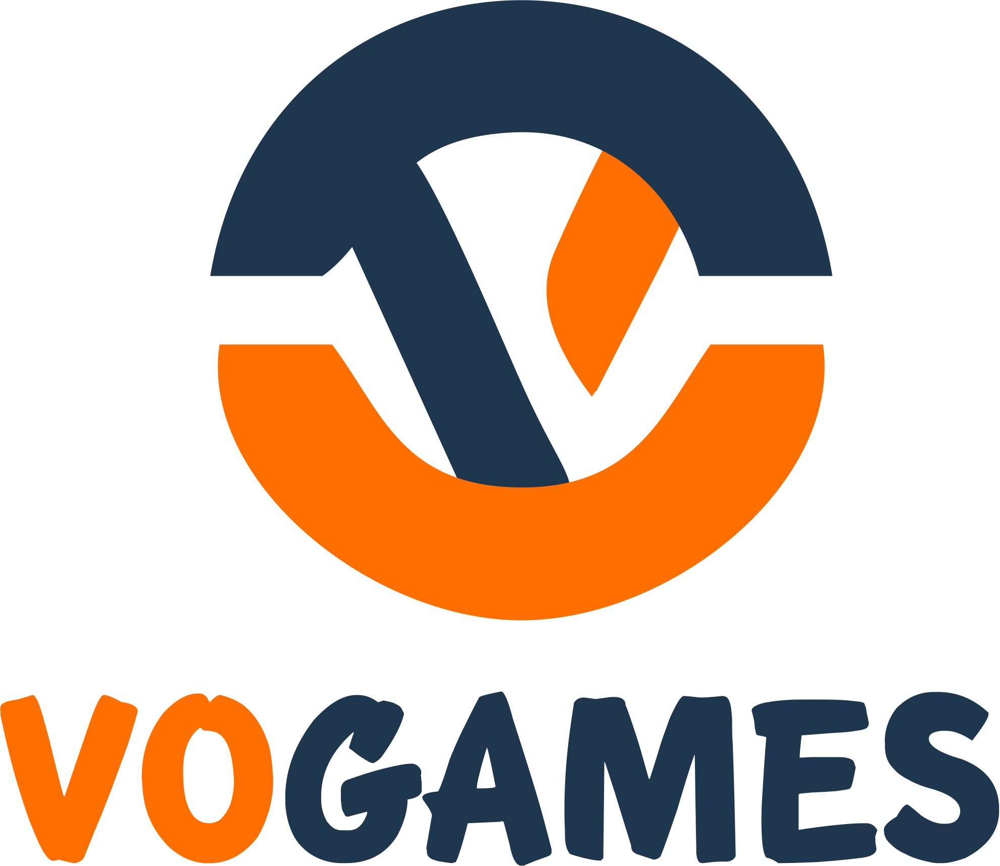

<div id="top"></div>
<!--
*** Thanks for checking out the Best-README-Template. If you have a suggestion
*** that would make this better, please fork the repo and create a pull request
*** or simply open an issue with the tag "enhancement".
*** Don't forget to give the project a star!
*** Thanks again! Now go create something AMAZING! :D
-->


<!-- PROJECT SHIELDS -->
<!--
*** I'm using markdown "reference style" links for readability.
*** Reference links are enclosed in brackets [ ] instead of parentheses ( ).
*** See the bottom of this document for the declaration of the reference variables
*** for contributors-url, forks-url, etc. This is an optional, concise syntax you may use.
*** https://www.markdownguide.org/basic-syntax/#reference-style-links
-->
[![Contributors][contributors-shield]][contributors-url]
[![Forks][forks-shield]][forks-url]
[![Stargazers][stars-shield]][stars-url]
[![Issues][issues-shield]][issues-url]
[![MIT License][license-shield]][license-url]
[![LinkedIn][linkedin-shield]][linkedin-url]
[![rivaldofez][circleci-badge]][circleci-url]


<!-- PROJECT LOGO -->
<br />
<div align="center">
  <a href="https://github.com/rivaldofez/vogames">
    
  </a>

  <h3 align="center">Consumer App to save your favorite games</h3>
  </br>
</div>


<!-- TABLE OF CONTENTS -->
<details>
  <summary>Table of Contents</summary>
  <ol>
    <li>
      <a href="#about-the-project">About The Project</a>
      <ul>
        <li><a href="#built-with">Built With</a></li>
      </ul>
    </li>
    <li>
      <a href="#getting-started">Getting Started</a>
      <ul>
        <li><a href="#prerequisites">Prerequisites</a></li>
        <li><a href="#installation">Installation</a></li>
      </ul>
    </li>
    <li><a href="#usage">Usage</a></li>
    <li><a href="#roadmap">Roadmap</a></li>
    <li><a href="#contributing">Contributing</a></li>
    <li><a href="#license">License</a></li>
    <li><a href="#contact">Contact</a></li>
    <li><a href="#acknowledgments">Acknowledgments</a></li>
  </ol>
</details>


<!-- ABOUT THE PROJECT -->
## About The Project

![Product Name Screen Shot][product-screenshot]

VoGames is consumer apps that fetch data from Games API. All games available in this apps and you can save your favorite games using favorite feature showed in detail game page


### Built With

This apps built with

* [Android Studio](https://developer.android.com/studio)
* [Kotlin](https://kotlinlang.org/)
* [Glide](https://github.com/bumptech/glide)
* [Retrofit](https://square.github.io/retrofit/)
* [Bubble Navigation](https://github.com/gauravk95/bubble-navigation)

and also implement
* Clean Architecture
* Jetpack Navigation
* View Binding

<p align="right">(<a href="#top">back to top</a>)</p>


<!-- GETTING STARTED -->
## Getting Started

To copy this project, you must have android studio to open and build copy of the project cloned via github

### Prerequisites

Clone repository using git
* git
  ```sh
  git clone https://github.com/rivaldofez/vogames.git
  ```

### Installation

Installation steps

1. Download and setup your android studio from [Android Studio](https://developer.android.com/studio)
2. Load the project and build

<p align="right">(<a href="#top">back to top</a>)</p>


<!-- CONTRIBUTING -->
## Contributing

Contributions are things that make the open source community be an amazing place to learn, invent, and create new technologies. Any contributions you make are **greatly appreciated**.

If you have a suggestion that would make this better, please fork the repo and create a pull request. You can also simply open an issue with the tag "improvement".

1. Fork the Project
2. Create your Feature Branch (`git checkout -b feature/ImprovementFeature`)
3. Commit your Changes (`git commit -m 'Add some ImprovementFeature'`)
4. Push to the Branch (`git push origin feature/ImprovementFeature`)
5. Open a Pull Request

<p align="right">(<a href="#top">back to top</a>)</p>


<!-- CONTACT -->
## Contact

Rivaldo Fernandes - [@rivaldofez](https://twitter.com/rivaldofez) - rivaldofez@gmail.com

Project Link: [https://github.com/rivaldofez/vogames](https://github.com/rivaldofez/vogames)

<p align="right">(<a href="#top">back to top</a>)</p>


<!-- ACKNOWLEDGMENTS -->
## Acknowledgments

This apps in one of my Submission while learning Android at Dicoding Indonesia


<!-- MARKDOWN LINKS & IMAGES -->
<!-- https://www.markdownguide.org/basic-syntax/#reference-style-links -->
[contributors-shield]: https://img.shields.io/github/contributors/rivaldofez/vogames.svg?style=for-the-badge

[contributors-url]: https://github.com/rivaldofez/vogames/graphs/contributors

[forks-shield]: https://img.shields.io/github/forks/rivaldofez/vogames.svg?style=for-the-badge

[forks-url]: https://github.com/rivaldofez/vogames/network/members

[stars-shield]: https://img.shields.io/github/stars/rivaldofez/vogames.svg?style=for-the-badge

[stars-url]: https://github.com/othneildrew/Best-README-Template/stargazers

[issues-shield]: https://img.shields.io/github/issues/othneildrew/Best-README-Template.svg?style=for-the-badge

[issues-url]: https://github.com/rivaldofez/vogames/issues

[license-shield]: https://img.shields.io/github/license/rivaldofez/vogames.svg?style=for-the-badge

[license-url]: https://github.com/rivaldofez/vogames/blob/master/LICENSE.txt

[linkedin-shield]: https://img.shields.io/badge/-LinkedIn-black.svg?style=for-the-badge&logo=linkedin&colorB=555

[linkedin-url]: https://www.linkedin.com/in/rivaldofez

[product-screenshot]: images/SS01.png

[circleci-badge]: https://circleci.com/gh/rivaldofez/vogames.svg?style=svg

[circleci-url]: https://circleci.com/gh/rivaldofez/vogames
